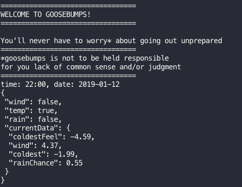
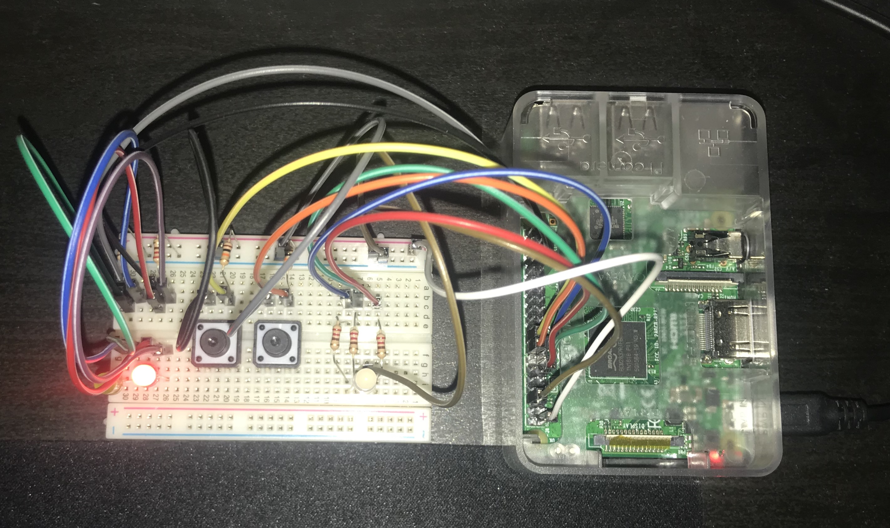
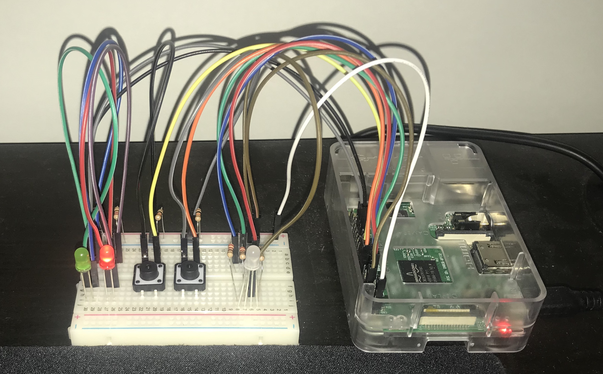
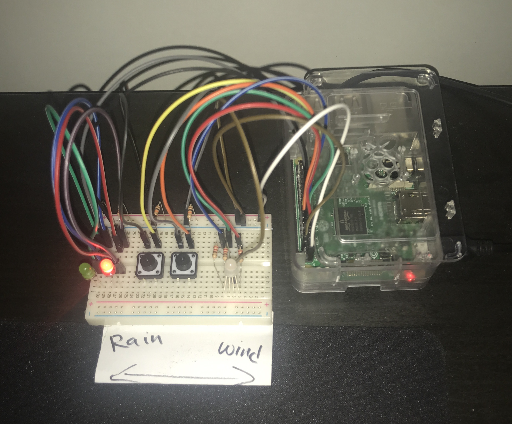

# Goosebumps
_Not today, Weather!_
#### Version 1.5
## Features

We watch the Weather so you dont need to get goosebumps!
Do you ever want to know whats hiding up there?? Well, with goosebumps, you can always be prepared for the Weather's curve-balls.
Rain? Wind? Temperature? You can bet that Goosebumps will have your back.

1. ```notCold == green ``` __&&__ ```veryCold == red``` 
2. ___```rain == blue Multi-Led```___ Can display, in binary terms, whether its going to rain in the next 5 hours 
3. ___```windy == white Multi-Led```___ Can display, in binary terms, whether its gonna be windy in the next 5 hours 
4. Fetches data hourly... with a rainbow show 

#### New Features
1. Prints out data to the console
    this includes:
    - wind
    - rain 
    - data sets for the next 5 hours/ hour
    - wind and rain checks for the next 12 hours
    - more accurate data updates
    - more accurate data 
    - prettier interface
    



## Architecture
### Software
The project has a top down structure given the constraints that were faced when importing components in python.
Components include:
- [led.py](./src/components/led.py) that works with the led bulbs
    >within ```led.py```, there are two classes that handle single color and multi-colored leds
- [weather_api.py](./src/components/weather_api.py) that works as a interface for the [Darksky](https://darksky.net/poweredby/) __api__.
    >initially, ```weather_api.py``` held two different apis, but now it mostly handles the darksky api since its the most accurate weather api I have used so far

(_if anyone whiches to do so [im so bored please do so]_)

### Hardware
1. __default pins__
- 3.3.v
- GND

2. __multi-color Led pins__
- red = GPIO 17 [pin 11]
- green = GPIO 27 [pin 13]
- blue = GPIO 22 [pin 15]

3. __LEDS__
- red LED = GPIO 13 [pin 33]
- green LED = GPIO 6 [pin 31]

4. __buttons__
- _lButton_ = GPIO 23 [pin 16]
- _rButton_ = GPIO 24 [pin 18]

6. __resistors__
_one for each __led__ or __button___



#### just some more pictures 📸



Tweet 🦉 me at [@oliver_manzi](https://twitter.com/oliver_manzi) for more info or collaborations or anything :D

```2019 Oliver Manzi 🤠```
