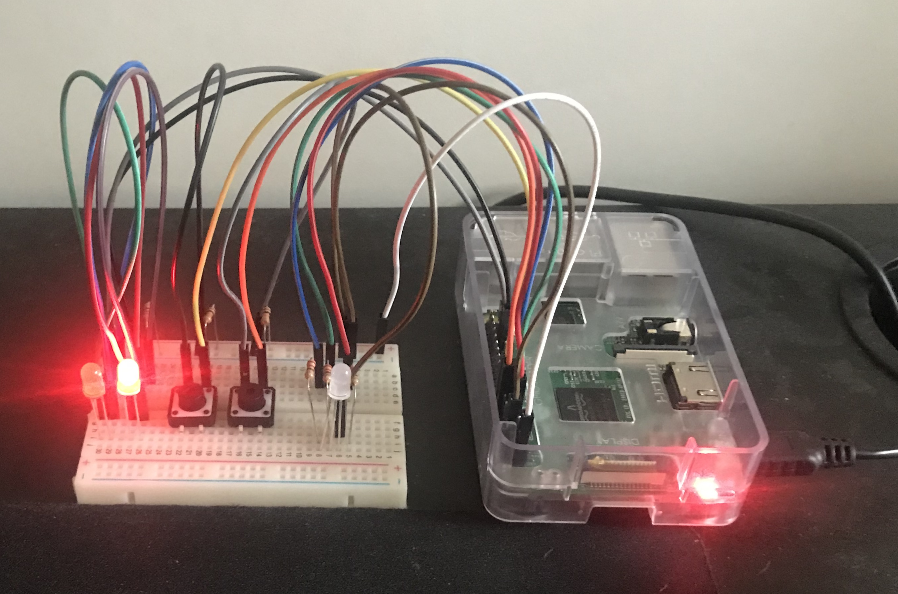

# Goosebumps
_Not today, Weather!_
#### Version 1.0

We watch the Weather so you dont need to get goosebumps!
Do you ever want to know whats hiding up there?? Well, with goosebumps, you can always be prepared for the Weather's curve-balls.
Rain? Wind? Temperature? You can bet that Goosebumps will have your back.

## Setting up
### Hardware
1. __default pins__
- 3.3.v
- GND

2. __multi-color Led pins__
- red = GPIO 17 [pin 11]
- green = GPIO 27 [pin 13]
- blue = GPIO 22 [pin 15]

3. __LEDS__
- red LED = GPIO 13 [pin 33]
- green LED = GPIO 6 [pin 31]

4. __buttons__
- _lButton_ = GPIO 23 [pin 16]
- _rButton_ = GPIO 24 [pin 18]

### Software
I started working on python 2 days ago and I have been using the default python and python3 exchanably which is a BBIIGG "no no"
so to solve that issue, the goosebump project will be developed in PYTHON3 so please keep that in mind when pull requesting (if anyone whiches to do so[im so bored please do so])

#### Features
1. Always displayys current temperature
2. Can display, in binary terms, whether its going to rain in the next 5 hours
3. Can display, in binary terms, whether itvs gonna be windy in the next 5 hours
4. Fetches data hourly... with a rainbow show

#### New Features
1. Prints out data to the console
    this includes:
    - wind
    - rain 
    - data sets for the next 5 hours/ hour
    - wind and rain checks for the next 12 hours
    - more accurate data updates

